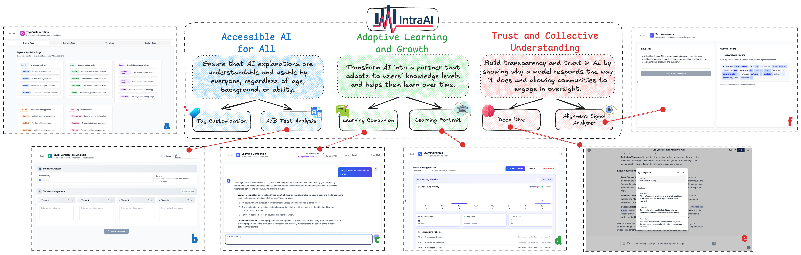

<div align="center">
  
  
  **Bridging Human-AI Understanding Through Intelligent Interface Design**
</div>



## 📋 Overview

IntraAI is an intelligent chat platform that adapts to users' knowledge levels and helps them learn over time. It provides accessible AI explanations that are understandable and usable by everyone, regardless of age, background, or ability.

> **Note:** IntraAI's UI is built on top of [chatbot-ui](https://github.com/mckaywrigley/chatbot-ui), an excellent open-source AI chat interface. We're grateful to [Mckay Wrigley](https://github.com/mckaywrigley) and the chatbot-ui community for providing such a solid foundation for our project.

## ✨ Features

### 🎯 Adaptive Learning and Growth
- **Learning Companion**: Interactive AI partner that adapts to your knowledge level
- **Learning Portrait**: Track your learning progress and patterns over time

### 🔍 Deep Dive
- **Deep Dive Analysis**: Understand why AI responds the way it does with detailed explanations
- **Context Exploration**: Explore related topics and connections

### 📊 Comparative Evaluation Analyzer
- **Content Comparison**: Compare multiple AI responses side-by-side
- **Industry-Specific Analysis**: Get tailored evaluations for different industries
- **Performance Metrics**: Detailed metrics including response time, token count, and quality scores

### 🏷️ Tag Customization
- **Customizable AI Personas**: Define AI identity, style, level, values, and task types
- **Flexible Communication**: Adapt AI responses to your preferences and needs

### 💡 Alignment Signal Analyzer
- **Semantic Analysis**: Analyze text importance and semantic awareness
- **Visualization**: Visual representation of word importance and context
- **Alignment Signal**: Analyze the alignment signal of the text

## 💻 Local Quickstart

Follow these steps to get your own IntraAI instance running locally.

### 1. Clone the Repo

```bash
git clone https://github.com/wad3birch/IntraAI.git
cd intraai/chatbot-ui
```

### 2. Install Dependencies

Open a terminal in the root directory of your local IntraAI repository and run:

```bash
npm install
```

### 3. Install Supabase & Run Locally

#### Why Supabase?

IntraAI uses Supabase for secure data storage, enabling multi-modal use cases and providing a robust backend for learning analytics and user preferences.

#### 1. Install Docker

You will need to install Docker to run Supabase locally. You can download it [here](https://docs.docker.com/get-docker) for free.

#### 2. Install Supabase CLI

**MacOS/Linux**

```bash
brew install supabase/tap/supabase
```

**Windows**

```bash
scoop bucket add supabase https://github.com/supabase/scoop-bucket.git
scoop install supabase
```

#### 3. Start Supabase

In your terminal at the root of your local IntraAI repository, run:

```bash
supabase start
```

### 4. Fill in Secrets

#### 1. Environment Variables

In your terminal at the root of your local IntraAI repository, run:

```bash
cp .env.local.example .env.local
```

Get the required values by running:

```bash
supabase status
```

Note: Use `API URL` from `supabase status` for `NEXT_PUBLIC_SUPABASE_URL`

Now go to your `.env.local` file and fill in the values.

If the environment variable is set, it will disable the input in the user settings.

#### 2. SQL Setup

In the 1st migration file `supabase/migrations/20240108234540_setup.sql` you will need to replace 2 values with the values you got above:

- `project_url` (line 53): `http://supabase_kong_chatbotui:8000` (default) can remain unchanged if you don't change your `project_id` in the `config.toml` file
- `service_role_key` (line 54): You got this value from running `supabase status`

This prevents issues with storage files not being deleted properly.

### 5. Install Ollama (optional for local models)

Follow the instructions [here](https://github.com/jmorganca/ollama#macos).

### 6. Run app locally

In your terminal at the root of your local IntraAI repository, run:

```bash
npm run chat
```

Your local instance of IntraAI should now be running at [http://localhost:3000](http://localhost:3000). Be sure to use a compatible node version (i.e. v18).

You can view your backend GUI at [http://localhost:54323/project/default/editor](http://localhost:54323/project/default/editor).

## ☁️ Hosted Quickstart

Follow these steps to get your own IntraAI instance running in the cloud.

### 1. Follow Local Quickstart

Repeat steps 1-4 in "Local Quickstart" above.

You will want separate repositories for your local and hosted instances.

Create a new repository for your hosted instance of IntraAI on GitHub and push your code to it.

### 2. Setup Backend with Supabase

#### 1. Create a new project

Go to [Supabase](https://supabase.com/) and create a new project.

#### 2. Get Project Values

Once you are in the project dashboard, click on the "Project Settings" icon tab on the far bottom left.

Here you will get the values for the following environment variables:

- `Project Ref`: Found in "General settings" as "Reference ID"
- `Project ID`: Found in the URL of your project dashboard (Ex: https://supabase.com/dashboard/project/<YOUR_PROJECT_ID>/settings/general)

While still in "Settings" click on the "API" text tab on the left.

Here you will get the values for the following environment variables:

- `Project URL`: Found in "API Settings" as "Project URL"
- `Anon key`: Found in "Project API keys" as "anon public"
- `Service role key`: Found in "Project API keys" as "service_role" (Reminder: Treat this like a password!)

#### 3. Configure Auth

Next, click on the "Authentication" icon tab on the far left.

In the text tabs, click on "Providers" and make sure "Email" is enabled.

We recommend turning off "Confirm email" for your own personal instance.

#### 4. Connect to Hosted DB

Open up your repository for your hosted instance of IntraAI.

In the 1st migration file `supabase/migrations/20240108234540_setup.sql` you will need to replace 2 values with the values you got above:

- `project_url` (line 53): Use the `Project URL` value from above
- `service_role_key` (line 54): Use the `Service role key` value from above

Now, open a terminal in the root directory of your local IntraAI repository. We will execute a few commands here.

Login to Supabase by running:

```bash
supabase login
```

Next, link your project by running the following command with the "Project ID" you got above:

```bash
supabase link --project-ref <project-id>
```

Your project should now be linked.

Finally, push your database to Supabase by running:

```bash
supabase db push
```

Your hosted database should now be set up!

### 3. Setup Frontend with Vercel

Go to [Vercel](https://vercel.com/) and create a new project.

In the setup page, import your GitHub repository for your hosted instance of IntraAI. Within the project Settings, in the "Build & Development Settings" section, switch Framework Preset to "Next.js".

In environment variables, add the following from the values you got above:

- `NEXT_PUBLIC_SUPABASE_URL`
- `NEXT_PUBLIC_SUPABASE_ANON_KEY`
- `SUPABASE_SERVICE_ROLE_KEY`
- `NEXT_PUBLIC_OLLAMA_URL` (only needed when using local Ollama models; default: `http://localhost:11434`)

You can also add API keys as environment variables.

- `OPENAI_API_KEY`
- `AZURE_OPENAI_API_KEY`
- `AZURE_OPENAI_ENDPOINT`
- `AZURE_GPT_45_VISION_NAME`

For the full list of environment variables, refer to the '.env.local.example' file. If the environment variables are set for API keys, it will disable the input in the user settings.

Click "Deploy" and wait for your frontend to deploy.

Once deployed, you should be able to use your hosted instance of IntraAI via the URL Vercel gives you.

## 🔄 Updating

In your terminal at the root of your local IntraAI repository, run:

```bash
npm run update
```

If you run a hosted instance you'll also need to run:

```bash
npm run db-push
```

to apply the latest migrations to your live database.

## 🔧 Troubleshooting

### Coherence JSON Error

If you encounter a coherence JSON error or similar data consistency issues, open your browser's developer console and run the following code:

```javascript
localStorage.clear();
sessionStorage.clear();

document.cookie.split(";").forEach(function(c) { 
  document.cookie = c.replace(/^ +/, "").replace(/=.*/, "=;expires=" + new Date().toUTCString() + ";path=/"); 
});

if ('indexedDB' in window) {
  indexedDB.databases().then(databases => {
    databases.forEach(db => {
      indexedDB.deleteDatabase(db.name);
    });
  });
}

window.location.reload(true);
```

This will clear all local storage, session storage, cookies, and IndexedDB data, then reload the page. This should resolve most data consistency issues.

## 🐛 Issues

We restrict "Issues" to actual issues related to the codebase.

We're getting excessive amounts of issues that amount to things like feature requests, cloud provider issues, etc.

If you are having issues with things like setup, please refer to the "Help" section in the "Discussions" tab above.

Issues unrelated to the codebase will likely be closed immediately.

## 💬 Discussions

We highly encourage you to participate in the "Discussions" tab above!

Discussions are a great place to ask questions, share ideas, and get help.

Odds are if you have a question, someone else has the same question.

## 🤝 Contributing

We are working on a guide for contributing.

## 📄 License

See the [license](license) file for details.